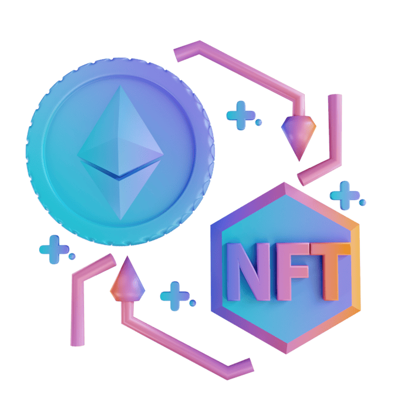

#   Cyberpunk Web3 Avatars — NFT Minting dApp

A sleek, cyberpunk-themed NFT minting dApp that allows users to mint unique, on-chain **ERC-721 avatars** with rich metadata stored on IPFS via Pinata.  

Built with **Solidity, Hardhat, Next.js (App Router), wagmi, RainbowKit, and Tailwind CSS**, and deployed on **Ethereum Sepolia**.

---

## 🌐 Live Demo

- **Frontend (Vercel):**  https://avatar-nft-minter-amber.vercel.app/

- **Smart Contract (Sepolia Etherscan):**  https://sepolia.etherscan.io/token/0x1d5c2b4e864a009B3691AceD09d048D520bb7aA2

---

## ✨ Features

- 🖼️ **Curated NFT Collection**  
  10 *Cyberpunk Web3 Avatars* with unique identities and traits.

- 🔐 **Wallet-Native Minting**  
  Seamless wallet connection using RainbowKit (MetaMask, WalletConnect, etc.).

- 🧾 **IPFS-Hosted Metadata**  
  Images and metadata stored on IPFS via Pinata for true decentralization.

- 🎴 **Interactive NFT Preview**  
  - 3D Y-axis flip animation  
  - Toggle between NFT artwork and attribute metadata  
  - Clean, classic, OpenSea-style UI

- ⛓️ **On-Chain Ownership Detection**  
  Minted NFTs are dynamically marked as *Minted* or *Yours* in the UI.

- 🚀 **Production-Grade UX**  
  Transaction feedback, Etherscan links, responsive design, and smooth animations.

---

## 🛠️ Tech Stack

### Smart Contracts
- **Solidity ^0.8.27**
- **OpenZeppelin ERC721 + URI Storage**
- **Ethereum Sepolia Testnet**

### Frontend
- **Next.js (App Router)**
- **TypeScript**
- **Viem + wagmi**
- **RainbowKit**
- **Tailwind CSS**
- **react-hot-toast**

### Storage & Infra
- **Pinata (IPFS)**
- **Vercel (Frontend Deployment)**

---

## 📦 Smart Contract Overview

### `AvatarNft.sol`

```solidity
function safeMint(address to, string memory uri)
  public
  returns (uint256)
```
- Mints a unique ERC-721 NFT
- Assigns metadata via tokenURI
- Uses incremental token IDs
- Fully compatible with NFT marketplaces

---

## 🎨 NFT Metadata Structure (ERC-721 Standard)
```json
{
  "name": "Oracle Veil",
  "description": "A mysterious oracle reading on-chain truths.",
  "image": "ipfs://QmWbp2hMrQadQsXicmTf8eKGt957ZuuVyCSNNjC3oZRduv",
  "attributes": [
    { "trait_type": "Role", "value": "Oracle" },
    { "trait_type": "Network", "value": "Ethereum" },
    { "trait_type": "Eyes", "value": "Glowing" },
    { "trait_type": "Headgear", "value": "Hood" },
    { "trait_type": "Rarity", "value": "Rare" }
  ]
}

```

---

## 🚀 Getting Started Locally

1️⃣ Clone the Repository
```
git clone https://github.com/RAHULDINDIGALA-32/avatar-nft-minter.git
cd avatar-nft-minter
```

2️⃣ Install Dependencies
```
cd app
npm install
```

3️⃣ Run the Development Server
```
npm run dev
```
Open http://localhost:3000 in your browser.

---

## 🔐 Environment Setup

- Ensure your wallet is connected to Sepolia Testnet and funded with test ETH.
- No backend or API keys are required for frontend minting.

---

## 📜 License

This project is licensed under the MIT License.

---

## Developer

Built with ❤️ by Rahul Dindigala

GitHub: https://github.com/RAHULDINDIGALA-32

---

### 🧠 Future Improvements

- Mint price & max supply enforcement
- On-chain whitelist / allowlist
- Trait rarity visualization
- Subgraph indexing
- Mainnet deployment
